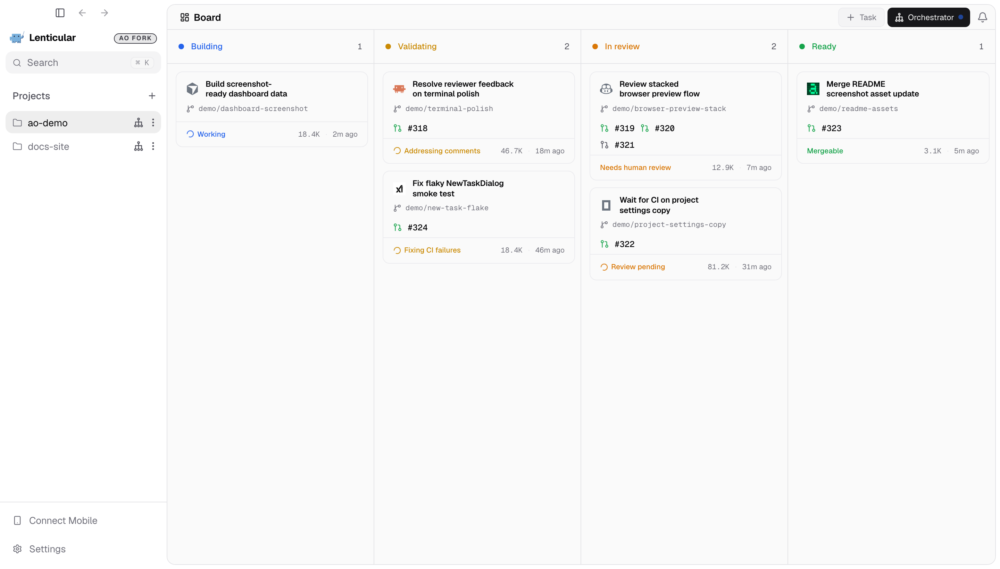
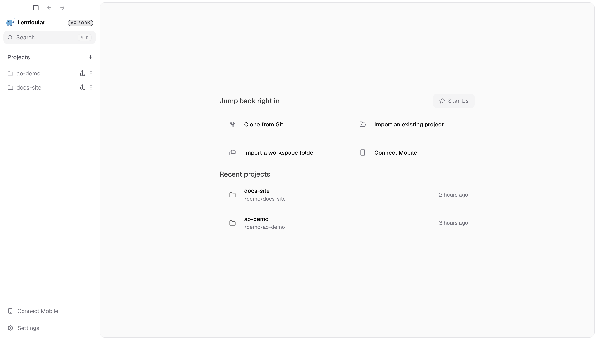
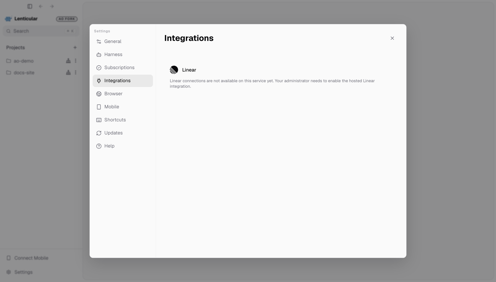

<div align="center">

# 🐳 Lenticular

**An Agent Orchestrator fork for local, agent-driven development.**

Plan with a project orchestrator. Run focused workers in isolated workspaces.<br />
Follow implementation, validation, review, and merge from one desktop.

[Get started](#get-started) &nbsp;&bull;&nbsp; [Linear integration](#delegate-from-linear) &nbsp;&bull;&nbsp; [Development guide](docs/development.md) &nbsp;&bull;&nbsp; [Upstream AO](https://github.com/Untrivial-ai/agent-orchestrator)


</div>

Lenticular builds on [Agent Orchestrator](https://github.com/Untrivial-ai/agent-orchestrator). This fork includes Lenticular branding, a refreshed home screen and project sidebar, updated task cards and browser controls, and an opt-in Linear integration that routes work to agents on your machine. The CLI and underlying daemon retain the `ao` name.

*Screenshots show the current renderer with built-in demo data. Browser preview does not run the desktop daemon or agents; Linear settings show the unconfigured service state.*

## Get started

For the upstream AO desktop app, use [GitHub Releases](https://github.com/Untrivial-ai/agent-orchestrator/releases/latest). The desktop app is the recommended install path and handles its own daemon and updates. Those upstream builds do not include this fork's custom changes.

To run Lenticular from this checkout, install the prerequisites and dependencies in the [development guide](docs/development.md), then launch the desktop:

```bash
cd frontend
npm run dev
```

From the home screen, **Clone from Git**, **Import an existing project**, or **Import a workspace folder**. Recent projects let you return to ongoing work. The sidebar keeps projects, their orchestrators, search, settings, and Connect Mobile within reach.



For a renderer-only preview with demo data, run `npm run dev:web` from `frontend/`. It does not launch Electron or execute agents.

## Workers execute focused tasks

A worker keeps one task, coding agent, and workspace together. Choose **Task** on a project board, describe the outcome, and select the agent, model, and supported interface. Git-backed workers get their own branch and worktree; Scratch workers use AO-managed branchless directories.

Use structured Chat or the agent's native terminal UI. Open a worker to continue its conversation, inspect changed files, run a workspace shell, preview its app, or review pull requests. Compatible Claude Code and Codex sessions can switch between Chat and Terminal UI while preserving the native conversation and workspace.

## The orchestrator plans across the project

The project orchestrator is the persistent planning and coordination agent above individual workers. Use it to explore an idea, reason through tradeoffs, set priorities, and turn a larger outcome into focused tasks.

Its project-scoped conversation keeps planning context alongside the current workers, pull requests, CI, and reviews. It can delegate work, pass workers relevant context, follow progress, and coordinate follow-ups. Workers handle implementation, tests, commits, and pull requests.

## Follow work from build to merge

The project board groups workers by their current phase. Card details keep agent activity, branch, pull requests, token usage, and recency together; multiple PRs stay attached to the same worker.

| Lane | What it shows |
| --- | --- |
| **Building** | Work being implemented, including workers waiting for input before a PR is ready. |
| **Validating** | Workers addressing CI failures, review comments, or other validation work. |
| **In review** | Pull requests waiting on checks or human review. |
| **Ready** | Work that is approved, mergeable, or merged and awaiting archive. |

Session activity and PR facts determine the displayed state. Open a card to inspect the cause, answer the agent, or review the work. Per-session controls can automatically return CI failures and review feedback to the worker that owns them.

## Delegate from Linear

**Settings → Integrations → Linear** connects Linear delegation to local workers. With the integration service and OAuth app configured, sign in, select an organization, connect a Linear workspace, and create an agent profile for a team, optional Linear project, and an existing local Lenticular project.

The local runner receives delegated work and creates Chat sessions through the daemon. Follow-up instructions return to the same session, and completed turn text and failures are reported back to Linear. Approval and structured-input requests are answered in Lenticular. Keep the desktop running to receive work; pausing intake leaves existing tasks running.

Profiles can be renamed, edited, paused, and resumed. Disconnecting a runner stops its connection. The bridge does not automatically mark issues Done, merge PRs, or approve agent requests.



This is opt-in development functionality, not a preconfigured hosted service. See the [Linear settings and local setup guide](docs/linear-settings-implementation.md) for the local service, OAuth requirements, routing, and runner lifecycle, and the [bridge guide](docs/linear-local-bridge.md) for execution behavior and limitations.

## More in the workspace

- **Pull requests and reviews:** inspect CI, mergeability, review state, and interactive agent reviews beside the worker, including sessions with several PRs.
- **Isolated browser previews:** each worker has its own browser profile, tabs, and popups. The refreshed browser toolbar keeps navigation and the current domain visible; agents can inspect and operate the preview with `ao browser`.
- **Explicit preview targets:** use `ao preview <url>` inside a session to open its local app in the Browser panel. Detached Chromium DevTools can stay open alongside agent automation.
- **Files and workspace shells:** inspect changed files and diffs, including untracked files in child repositories, without losing the session context.
- **Notifications:** follow requests for input and PR outcomes through the notification center.
- **Connect Mobile:** access sessions from the companion app over a trusted local network using the opt-in authenticated LAN listener.
- **Agent settings:** manage harness readiness and Codex accounts, authentication, and usage from settings.

## Supported agents

Lenticular inherits AO's agent adapters, including Claude Code, Codex, Cursor, OpenCode, and the agents below. Chat, Terminal UI, and interactive-review support vary by agent; use the installed harness's supported capabilities.

<table>
  <tr valign="middle">
    <td width="33%" valign="middle" nowrap> &nbsp; <b>Claude Code</b></td>
    <td width="33%" valign="middle" nowrap> &nbsp; <b>Codex</b></td>
    <td width="33%" valign="middle" nowrap> &nbsp; <b>Cursor</b></td>
  </tr>
  <tr valign="middle">
    <td valign="middle" nowrap> &nbsp; <b>opencode</b></td>
    <td valign="middle" nowrap> &nbsp; <b>Aider</b></td>
    <td valign="middle" nowrap> &nbsp; <b>GitHub Copilot</b></td>
  </tr>
  <tr valign="middle">
    <td valign="middle" nowrap> &nbsp; <b>Grok</b></td>
    <td valign="middle" nowrap> &nbsp; <b>Kimi</b></td>
    <td valign="middle" nowrap> &nbsp; <b>Pi</b></td>
  </tr>
  <tr valign="middle">
    <td valign="middle" nowrap> &nbsp; <b>Amp</b></td>
    <td valign="middle" nowrap> &nbsp; <b>Auggie</b></td>
    <td valign="middle" nowrap> &nbsp; <b>Droid</b></td>
  </tr>
  <tr valign="middle">
    <td valign="middle" nowrap> &nbsp; <b>Crush</b></td>
    <td valign="middle" nowrap> &nbsp; <b>Cline</b></td>
    <td valign="middle" nowrap> &nbsp; <b>Goose</b></td>
  </tr>
  <tr valign="middle">
    <td valign="middle" nowrap> &nbsp; <b>Qwen</b></td>
    <td valign="middle" nowrap> &nbsp; <b>Continue</b></td>
    <td valign="middle" nowrap> &nbsp; <b>Devin</b></td>
  </tr>
  <tr valign="middle">
    <td valign="middle" nowrap> &nbsp; <b>Kiro</b></td>
    <td valign="middle" nowrap> &nbsp; <b>Kilo Code</b></td>
    <td valign="middle" nowrap> &nbsp; <b>Vibe</b></td>
  </tr>
  <tr valign="middle">
    <td valign="middle" nowrap> &nbsp; <b>Muse</b></td>
    <td valign="middle" nowrap> &nbsp; <b>Agy</b></td>
    <td valign="middle" nowrap><picture><source media="(prefers-color-scheme: dark)" srcset="docs/assets/readme/agents/autohand-stacked-dark.png" /></picture> <b>Autohand</b></td>
  </tr>
  <tr valign="middle">
    <td valign="middle" nowrap> &nbsp; <b>Kimchi</b></td>
    <td valign="middle" nowrap> &nbsp; <b>Prime Agent</b></td>
    <td valign="middle" nowrap></td>
  </tr>
</table>

[Browse upstream agent setup guides →](https://aoagents.dev/docs/plugins/agents)

## Develop and contribute

Start with the [development guide](docs/development.md) for prerequisites, local setup, and validation commands. Read [AGENTS.md](AGENTS.md) for this repository's architecture boundaries and [CONTRIBUTING.md](CONTRIBUTING.md) for contribution guidance.

The Electron/React frontend is a supervisor over the local Go daemon. The daemon owns sessions, workspaces, lifecycle, storage, and agent execution. App state lives under `~/.ao`, with the documented environment overrides.

## Documentation

| Document | What it covers |
| --- | --- |
| [Linear settings and setup](docs/linear-settings-implementation.md) | This fork's integration UI, local service, OAuth, profiles, and runner setup. |
| [Linear execution bridge](docs/linear-local-bridge.md) | Delegation, follow-ups, stop handling, persistence, and known limitations. |
| [Architecture](docs/architecture.md) | Daemon boundaries, lifecycle, persistence, and status derivation. |
| [Backend code structure](docs/backend-code-structure.md) | Package ownership and implementation entry points. |
| [CLI](docs/cli/README.md) | `ao` commands and daemon route mapping. |
| [Development](docs/development.md) | Build, run, and test instructions. |
| [Status](docs/STATUS.md) | Rewrite implementation status and remaining work. |
| [Upstream product docs](https://aoagents.dev/docs) | AO installation, agent setup, and product usage. |

## Telemetry and privacy

See the [telemetry policy](docs/telemetry.md) for collection behavior and controls. Settings includes the option to share error events; environment policy can disable it.

## License and upstream

Lenticular is a fork of Agent Orchestrator, available under the [Apache License 2.0](LICENSE). Upstream documentation, releases, and community resources belong to the [Agent Orchestrator project](https://github.com/Untrivial-ai/agent-orchestrator). The [translated READMEs](translations/) describe upstream AO and may not reflect this fork's changes.
